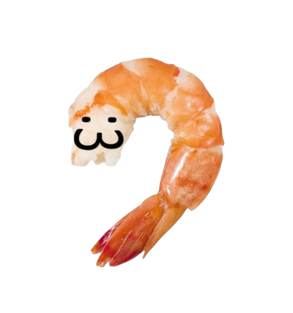

# 🦐 ShrimplyStraight

> **Never shrimp again.** A fun, privacy-friendly AI desktop companion that monitors your posture via webcam and keeps you from slouching with custom audio alerts and funny popups!

---

## What is ShrimplyStraight?

**ShrimplyStraight** is a lightweight Python background utility designed to keep your spine healthy. Using Google's **MediaPipe Pose Landmarker**, it tracks your neck and shoulder alignment in real-time. Whenever you start slouching or hunching over like a shrimp, it immediately alerts you with sound effects and randomized visual popups.

---

## Key Features

-  **Real-Time AI Pose Tracking**: Uses MediaPipe to track key body landmarks (shoulders and ears) without lagging your system.
- **Instant Calibration**: Automatically measures your neutral sitting posture during the first 30 frames (takes just 1–2 seconds).
- **Interactive Popups**:
  - **Classic Shrimp Warning** (75% chance) — Quick reminder to straighten your back.
  - **Whale Alert** (10% chance) — Humorous warning graphic.
  - **Krill Alert** (10% chance) — Extra visual reminder.
  - **"CERTIFIED SHRIMP" Photo Cam** (5% chance) — Captures a live snapshot of your slouching posture to keep you accountable!
- **Custom Sound Alerts**: Plays random `.mp3` audio files with built-in cooldown protection so you aren't overwhelmed.
- **Full System Tray Control**: Runs completely in the background. Right-click the shrimp icon near your Windows clock to toggle sounds, toggle popups, dismiss all active popups, or quit.
- **100% Privacy-First**: Everything runs completely locally on your machine. No video or pictures are ever uploaded anywhere. Snapshots taken for posture shaming are loaded into memory and immediately deleted from your disk.

---

## Step-by-Step User Manual (Easy Guide)

Here is everything you need to know to use ShrimplyStraight in your everyday workflow:

### 1. Starting the Application
- **Double-click** the **`Shrimply Straight`** shortcut (or run `Start_Shrimply.vbs`).
- The program runs silently in the background — you won't see a giant application window pop up.

### 2. Calibrating Your Posture
- When the app starts, **sit upright with good posture and look towards your screen/webcam for 1 to 2 seconds**.
- The app silently records 30 frames to establish your baseline posture threshold.

### 3. Working Normally
- Continue working, gaming, or browsing as usual.
- ShrimplyStraight will quietly monitor your posture from the Windows System Tray.

### 4. When You Slouch ("Shrimping")
- If your neck drops or you hunch forward for too long, an **alert sound** will play and a **popup** will appear on your screen.
- Click the button on the popup (e.g., *"I'll sit up!"*) to dismiss it, and straighten your back!

### 5. Managing the App via System Tray
Look at the **bottom-right corner of your screen** (the Windows Notification Area / System Tray near the clock). You may need to click the small `^` arrow to see hidden icons:



**Right-click the Shrimp icon** to open the menu:
- **`Close All Popups`**: Instantly closes any popups currently open on your screen.
- **`Sound Enabled`**: Click to check/uncheck and mute or unmute audio alerts.
- **`Popups Enabled`**: Click to check/uncheck and enable or disable visual popups.
- **`Quit`**: Completely shuts down the application and camera tracking.

### 6. How to Turn It Off
- **Right-click the Shrimp icon** in the system tray.
- Click **`Quit`**.
- That's it! All background tracking stops and any remaining popups close automatically.

---

## Installation & Setup

### Prerequisites
1. **Python 3.9 – 3.12** installed on your system.
2. A functional **Webcam** connected to your PC.

### 1. Clone or Download the Repository
```bash
git clone https://github.com/dontstaycozy/ShrimplyStraight.git
cd ShrimplyStraight
```

### 2. Install Required Packages
Open a terminal (Command Prompt or PowerShell) in the project directory and run:

```bash
pip install opencv-python mediapipe playsound3 pystray pillow numpy
```

### 3. Launching
You can run it directly with Python:
```bash
python main.py
```
Or start it in the background without a terminal window:
- Double-click **`Start_Shrimply.vbs`** or the **`Shrimply Straight.lnk`** shortcut.

---

## Project Structure

```text
ShrimplyStraight/
├── Shrimply Straight.lnk     # Windows Desktop shortcut
├── Start_Shrimply.vbs        # VBS launcher (runs pythonw silently in background)
├── main.py                   # Main detection loop, calibration, and tray icon logic
├── README.md                 # Project documentation & user guide
├── popups/                   # Standalone Tkinter popup scripts
│   ├── popup.py              # Default text warning popup
│   ├── picture_popup.py      # "Certified Shrimp" camera snapshot popup
│   ├── image_popup1.py       # Whale alert popup
│   └── image_popup2.py       # Krill alert popup
└── assets/
    ├── audio/                # Alert sound files (*.mp3)
    │   └── shrimp.mp3        # Default alert sound
    ├── images/               # App icons & graphic assets
    │   ├── shrimp_icon.ico
    │   ├── shrimp_icon.png
    │   ├── whale.jpg
    │   └── krill.jpg
    └── models/
        └── pose_landmarker.task  # MediaPipe Pose Landmarker model
```

---

## Customization

### Add Your Own Sounds
- Drop any `.mp3` file into the `assets/audio/` folder.
- ShrimplyStraight will automatically pick randomly from all MP3s in that folder whenever you slouch!

### Add or Change Images
- Replace or add images in `assets/images/` to customize the visuals shown in `popups/`.

---

## 🔬 How It Works (Technical Overview)

1. **Landmark Extraction**: Uses MediaPipe Pose Landmarker to extract coordinates for both ears (indices 7, 8) and shoulders (indices 11, 12).
2. **Posture Ratio Calculation**:
   $$\text{Posture Ratio} = \frac{\text{Mid-Shoulder } Y - \text{Mid-Ear } Y}{\text{Shoulder Width}}$$
   When you slouch or crane your head forward, the vertical distance between your ears and shoulders shrinks relative to your shoulder width.
3. **Thresholding**:
   - Baseline is computed as the average ratio over the first 30 detection frames.
   - The trigger threshold is set to $97\%$ of your baseline ratio (`POSTURE_TOLERANCE_RATIO = 0.97`).
4. **Alerts & Cooldown**:
   - If the ratio drops below threshold, an alert is triggered.
   - Built-in 1-second cooldown prevents spamming multiple alerts simultaneously.

---

## Troubleshooting & FAQ

**Q: I launched the program, but nothing appeared on screen?**  
**A:** This is normal! The app runs silently in your Windows System Tray (bottom-right near your clock). Look for the shrimp icon.

**Q: How do I recalibrate if I was slouching when I launched it?**  
**A:** Right-click the shrimp icon in your system tray, click **Quit**, sit up straight, and launch the app again.

**Q: Where are the webcam snapshots saved?**  
**A:** Nowhere! The snapshot popup temporarily saves `shrimp_snap.jpg`, loads it into memory for the popup window, and deletes the file from your disk immediately.

---

## License

This project is open-source and provided for personal, educational, and postural well-being use.
